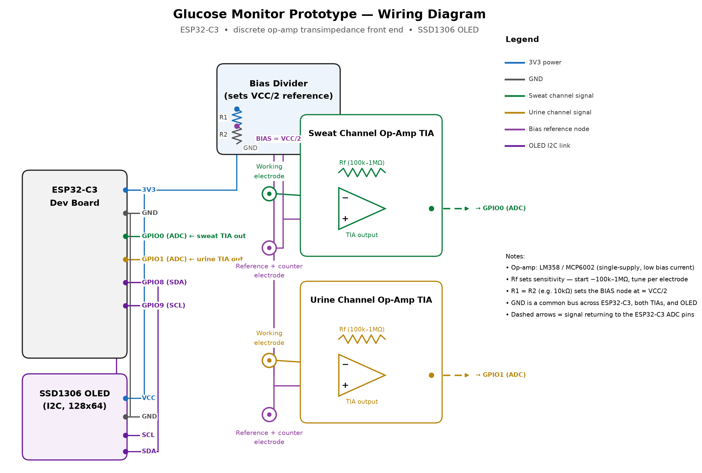

# Glucose Monitor (ESP32-C3, sweat + urine, DIY biosensor)

**⚠️ Not a medical device.** This is a research/educational electrochemical
biosensor rig. Sweat and urine glucose do NOT reliably track blood glucose
(see "Limitations" below). Do not use it to make insulin or treatment decisions.

## What this measures

Two independent electrochemical channels, each a 2-electrode amperometric
glucose oxidase (GOx) enzyme sensor read through a **discrete op-amp
transimpedance amplifier (TIA)** — no potentiostat AFE IC, no external ADC.
This is the cheapest working version of the build.

- **Sweat channel** — GOx electrode → op-amp TIA → ESP32-C3 ADC (GPIO0)
- **Urine channel** — GOx electrode → op-amp TIA → ESP32-C3 ADC (GPIO1)

The GOx enzyme oxidizes glucose and produces a small current proportional
(roughly, over a limited range) to glucose concentration. Each TIA converts
that current to a voltage the ESP32-C3's ADC can read directly.

## Hardware / BOM

| Part | Approx. cost | Notes |
|---|---|---|
| ESP32-C3 dev board | $3–5 | |
| 2x op-amp (LM358 or MCP6002, dual/single-supply, low bias current) | $0.30–1 each | one per channel |
| Feedback resistors (Rf, start ~100 kΩ–1 MΩ) | ~$1 | tune per electrode's current range |
| Bias divider resistors (2x per channel, e.g. 10 kΩ/10 kΩ off VCC) | ~$1 | sets working point at VCC/2 |
| Breadboard + jumper wires | $3–5 | |
| 2x GOx enzyme electrode/strip (salvaged from cheap glucose test strips, or bare screen-printed electrodes) | $0.20–0.50 each | working + reference/counter leads tied per the circuit below |
| SSD1306 0.96" I2C OLED (128x64) | $3–6 | displays both readings; shares the I2C bus (SDA/SCL) |

Total new spend: roughly **$11–20** if you don't already have a breadboard
and passive-component kit.

## Circuit (per channel)



This is a 2-electrode cell — no active bias control loop like the
LMP91000/AD5940 provide, just a fixed bias voltage. Less stable and more
drift-prone than a real 3-electrode potentiostat, but it's what disposable
glucometers do internally, and it's essentially free.

1. Bias node: resistor divider from VCC (3.3V) to GND, midpoint ≈ VCC/2.
   Buffer it with a spare op-amp stage if you have one free, or just use it
   directly for low-current draw.
2. Reference + counter electrode leads → tied together → bias node.
3. Working electrode → op-amp **inverting** input (this is the TIA's virtual
   ground, held at the bias node's voltage by feedback).
4. Op-amp **non-inverting** input → bias node.
5. Feedback resistor **Rf** between op-amp inverting input and op-amp output.
6. Op-amp output → ESP32-C3 ADC pin (GPIO0 for sweat, GPIO1 for urine).

Start with Rf around 100 kΩ–1 MΩ; raise it if readings are too small to
resolve, lower it if the op-amp output saturates against VCC. Use a
low-bias-current, single-supply op-amp (LM358/MCP6002 are cheap and common)
so the tiny electrode current isn't swamped by the amp's own input current.

### OLED wiring

The SSD1306 shares the same I2C bus as everything else in this build:

- OLED `SDA` → ESP32-C3 GPIO8
- OLED `SCL` → ESP32-C3 GPIO9
- OLED `VCC` → 3.3V, `GND` → GND
- I2C address defaults to `0x3C` in `src/main.cpp` (`OLED_ADDR`) — some
  boards ship at `0x3D`; if the display stays blank, try that instead.

## Firmware

PlatformIO project targeting `esp32-c3-devkitm-1` (this is standard Arduino
C++ — `framework = arduino` — so it also works if you copy `src/main.cpp`
into an `.ino` sketch for the Arduino IDE; just rename it and install the
two libraries below via Library Manager).

Libraries (declared in `platformio.ini`, or install manually for Arduino IDE):
- `Adafruit SSD1306`
- `Adafruit GFX Library`

```
pio run -t upload
pio device monitor
```

The firmware oversamples each analog channel (64 reads averaged per sample,
see `OVERSAMPLE_COUNT` in `src/main.cpp`) to compensate for the native ADC's
noise and nonlinearity, since there's no external precision ADC in this
version. Every sample cycle it prints CSV over serial
(`mv_sweat,mg_dl_sweat,mv_urine,mg_dl_urine`) and refreshes the OLED with
both channels' voltage and (once calibrated) estimated mg/dL.

## Calibration (required, and the hard part)

`include/Calibration.h` holds a simple two-point linear map from TIA output
voltage to concentration. Out of the box it's a placeholder — you must:

1. Prepare known-concentration glucose standards (e.g. 0, 50, 100, 200 mg/dL
   in saline/artificial sweat or urine).
2. Apply each standard to the relevant electrode, let the reading settle,
   and record the millivolt output printed over serial.
3. Fill in `LinearCal::mvLow/concLow` and `mvHigh/concHigh` for each channel
   in `src/main.cpp`. Until you do, `apply()` returns NaN on purpose and the
   OLED/serial output shows "(uncalibrated)" instead of a fake number.

Enzyme electrodes drift and degrade — re-calibrate each time you swap
electrodes, and expect the linear range to be narrow (enzymatic sensors
saturate at higher concentrations). Expect more drift here than with an
active-bias AFE, since the 2-electrode cell has no feedback correcting the
bias voltage as the electrode ages.

## Limitations (read before you build)

- **2-electrode cell, no active bias control**: less stable and more prone
  to drift than a 3-electrode potentiostat (LMP91000/AD5940). Re-calibrate
  often, and don't expect long-term absolute accuracy.
- **Native ESP32-C3 ADC**: nonlinear at low voltages and noisier than a
  precision external ADC. Oversampling helps but doesn't fully fix this —
  if you need better resolution later, add back an ADS1115 on the ADC
  output (I2C) without changing the analog front end.
- **Urine glucose** only appears once blood glucose exceeds the renal
  threshold (~180 mg/dL). Below that, urine glucose reads ~zero regardless
  of blood glucose — it's a threshold indicator, not a continuous curve.
- **Sweat glucose** concentration is roughly 100x lower than blood glucose,
  lags it by several minutes, and is heavily confounded by sweat rate,
  contamination, and electrode fouling. Expect a relative trend signal at
  best, not an absolute number, without extensive per-session calibration
  against a real glucometer.

## Repo layout

```
platformio.ini        - build config, OLED library deps
include/Calibration.h - two-point linear calibration struct
src/main.cpp           - sampling loop, ADC oversampling, OLED display, pin config
```

## Upgrade path

If drift/noise becomes a problem, the cheapest single upgrade is usually:
add an ADS1115 (still just I2C, ~$6–10) reading the same TIA outputs
instead of the native ADC, before spending on a full potentiostat AFE IC
(LMP91000/AD5940).
