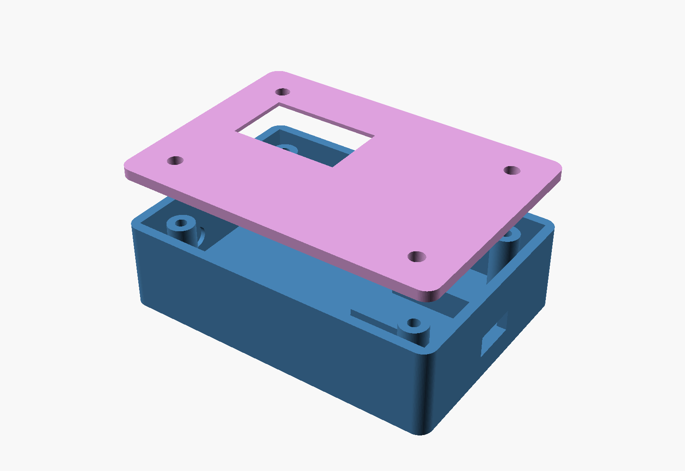

# 3D-Printed Enclosure

Parametric OpenSCAD design for a two-part, screw-down enclosure: `base.stl`
(component box) + `lid.stl` (OLED window + cover). Edit `enclosure.scad`
and re-export if your parts differ from the assumptions below.



## Assumptions -- verify before printing

These dimensions are sized generously around the BOM parts, but breakout
board / module sizes vary by supplier. Measure your actual parts and edit
the variables at the top of `enclosure.scad` if anything doesn't fit:

- **ESP32-C3**: a "SuperMini"-style board, resting on two support ribs
  inside the box (friction fit + a dab of hot glue; adjust rib size/position
  to your exact board).
- **Sensor circuit**: a small perfboard with the op-amp channels, resistors,
  and bias divider -- fits in the remaining cavity space.
- **OLED**: generic 0.96" SSD1306 I2C module, ~29.5 x 29.5mm PCB, ~24 x 13mm
  visible display area. The lid has a flush recessed pocket for the PCB
  (module glues/tapes in from inside) plus a smaller through-window sized
  for the visible glass -- this avoids depending on exact mounting-hole
  positions, which vary a lot between suppliers.
- **USB-C cutout**: one short wall, generously sized (10.5 x 5mm) --
  check it lines up with your specific board's connector position.
- **Electrode wire feedthroughs**: two 5mm holes on the opposite short wall
  for the sweat/urine twisted-pair leads.

## Dimensions

- Internal cavity: 70 x 48 x 18mm (L x W x H)
- Wall thickness: 2.2mm
- Outer footprint: ~74.4 x 52.4mm, ~20.2mm base + 2.4mm lid

## Assembly

1. Print `base.stl` upright (open side up), no supports needed.
2. Print `lid.stl` flat, no supports needed.
3. Mount the ESP32-C3 on the support ribs, the sensor perfboard in the
   remaining floor space, and route the electrode leads out through the
   two wire holes.
4. Glue or tape the OLED module into the lid's recessed pocket, screen
   facing out through the window.
5. Wire the OLED and sensor board per the [wiring diagram](../docs/wiring_diagram.png).
6. Screw the lid down onto the base's 4 posts with M3 self-tapping screws
   (each post has a 2.6mm pilot hole; the lid has 3.4mm clearance holes).

## Regenerating STLs

Requires [OpenSCAD](https://openscad.org/).

```bash
openscad -o base.stl -D 'part="base"' enclosure.scad
openscad -o lid.stl  -D 'part="lid"'  enclosure.scad
```
